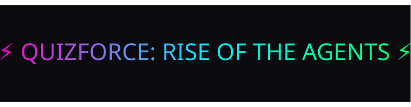
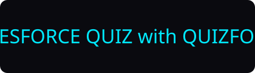

# QUIZFORCE--Rise-of-The-Agents

<p align="center">
  
</p>

<h1 align="center">⚡ TEST YOURE SALESFORCE KNOWLEDGE ⚡</h1>

<p align="center">
  
</p>

<p align="center">
  A futuristic neon‑themed multi‑stage quiz game built with HTML, CSS, and JavaScript.
</p>

---

## 🔰 Badges

<p align="center">
  
  
  
  
  
</p>

---

## 🎮 Overview

The **Neon Quiz Game** is an interactive, animated quiz experience featuring:

- Player onboarding
- Eligibility quiz
- Multi‑section main game
- Neon UI with glowing animations
- Dynamic scoring
- Game Over system (triggered after 3 wrong answers)
- Restart flow returning players to the main menu

Designed with a cyberpunk aesthetic and smooth transitions.

---

## ✨ Features

### 🔹 Start Screen
- Player name input  
- Welcome popup  
- Transition to eligibility quiz  

### 🔹 Eligibility Quiz
- Multiple‑choice questions  
- Score calculation  
- Unlocks main game  

### 🔹 Main Game Sections
- Section‑based quizzes  
- Neon animated blocks  
- Score tracking  
- Wrong‑answer detection  

### 🔹 Game Over System
Triggered when:
> ❌ More than **3 wrong answers** in any section

Displays:
- Neon animated **GAME OVER** screen  
- **Restart Game** button  

### 🔹 Restart Flow
- Resets scores  
- Clears UI  
- Returns to main game screen  

### 🔹Info Icon (ℹ️) — Game Rules Popup
- Smooth hover scaling  
- Neon glow effect  
- Pop with fade-in animation
- Helps users understand eligibility criteria, scoring, game flow. 

### 🔹Close Icon (✖) & Volume Icon (🔊 / 🔇)
- Toggles game audio on/off
- Allows user to mute  
- Allows user to exit the game with close icon

### 🔹⏳ Timer for Each Question
- Dynamic timer
- Timer reset automatically and quiz automatically move to the next question
- Each question has 20-second countdown.

### 🔹🎉 Confetti Celebration
- Triggered when Eligibility quiz & section quiz is passed.
- Uses lightweight canvas-confetti library for smooth performance.


---

## 🧩 Project Structure

|-- index.html
|-- style.css
|-- script.js
|--assets/
|  |--banner.svg
|  |--logo.svg
|  |--images,icons,music
|----README.md


---

## ⚙️ Core Logic

### Screen Switching ###

```js
function switchScreen(hide, show) {
  hide.classList.add("hidden");
  show.classList.remove("hidden");
}

### Screen Switching ###

let sectionScore = 0;
let finalScore = 0;
let wrongAnswers = 0;

### Game Over Trigger ###

if (wrongAnswers > 3) {
  showGameOver();
  return;
}

### Restart Flow ###

restartBtn.addEventListener("click", () => {
  gameOverScreen.classList.add("hidden");
  switchScreen(quizScreen, mainGameScreen);
});


🚀 How to Run-

1.Clone the repository

2.Open index.html in any browser

3.Enter your name

4.Complete eligibility quiz

5.Play main game sections

6.Avoid more than 3 wrong answers!


🛠️ Technologies Used

HTML5

CSS3 (Neon theme + animations)

JavaScript (ES6+)


🔮 Future Enhancements

Sound effects

Leaderboard

Timed questions

Difficulty levels

Section unlock animations


📄 License

Free for personal and educational use.


